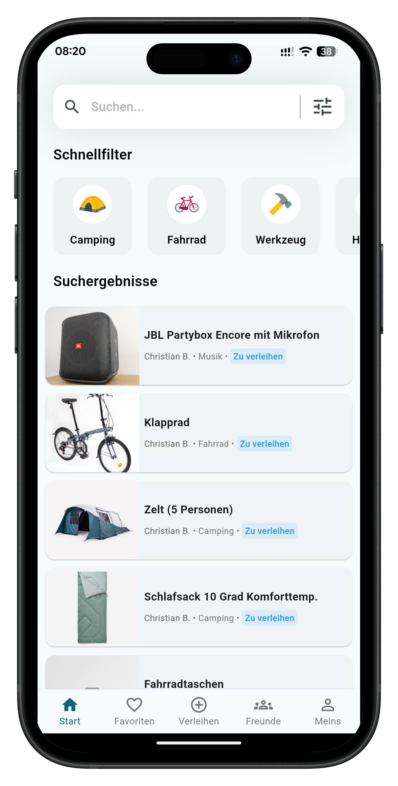
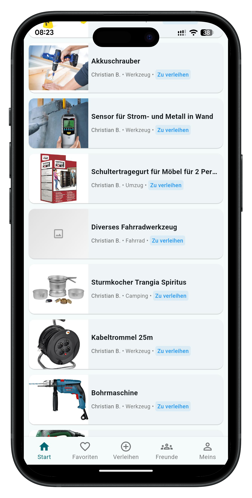
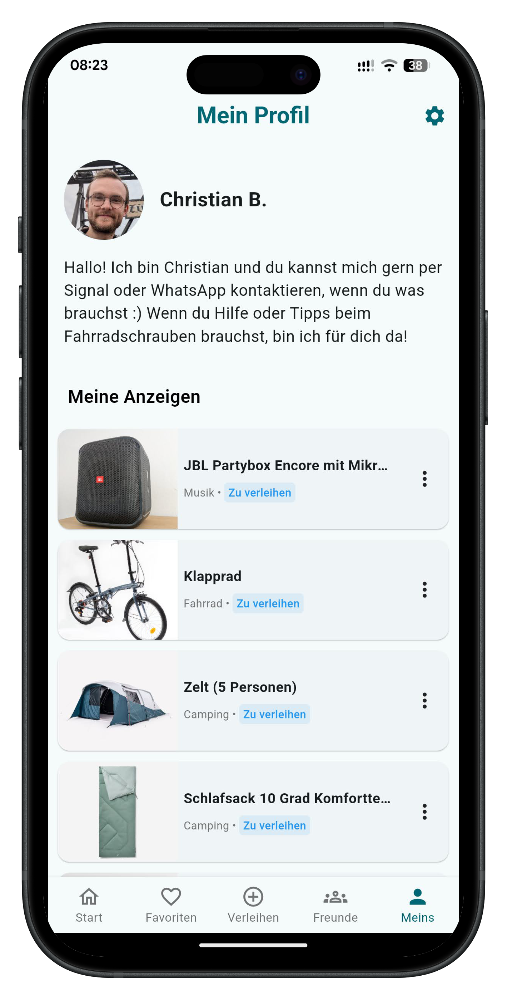

# BORO - A Community Lending Platform

BORO is a modern Flutter application that enables users to lend and find items within their community. Connect with neighbors, friends and others and promote sustainable sharing.


## Screenshots

<p float="left">
  
  
  
</p>

## Features

- 📱 **Modern UI**: Intuitive and engaging design
- 🔍 **Search & Discover**: Find items near you with advanced filtering
- 🤝 **Community Sharing**: Lend your items or give them away
- 👥 **Social Features**: Connect with friends and form lending groups
- 🔒 **Security**: Secure authentication and privacy protection
- 📸 **Item Showcase**: Upload and display item images
- 🌐 **Multi-language**: Support for English and German

## Technology Stack

- **Frontend**: Flutter with Material Design
- **Backend**: Supabase (PostgreSQL)
- **Authentication**: Supabase Auth with PKCE flow
- **Database**: PostgreSQL with Row Level Security
- **Storage**: Supabase Storage for images
- **Deployment**: Web (Vercel), Android (Google Play)

## Architecture

For complete architecture documentation, see [architecture.md](architecture.md).

## Project Structure

```
lib/
├── components/        # Reusable UI widgets
├── config/           # Configuration (Supabase)
├── l10n/             # Localization (English & German)
├── models/           # Data models
├── pages/            # Full-screen pages
├── services/         # Business logic
├── utils/            # Helper functions
└── main.dart         # App entry point
```

## Getting Started

### Prerequisites

- Flutter SDK (3.5.4 or higher)
- Dart SDK (3.5.4 or higher)
- Supabase account and project (The project is developed with the cloud-instance from Supabase. Local database for development and contribution is following.)
- Android Studio (for mobile development)

### Local Development

1. **Clone repository:**
```bash
git clone https://github.com/purechris/boro.git
cd boro
```

2. **Install dependencies:**
```bash
flutter pub get
```

3. **Configure Supabase:**
   - Copy `lib/config/supabase_config.dart.example` to `lib/config/supabase_config.dart`
   - Fill in your Supabase URL and anonymous key

4. **Run the app:**
```bash
flutter run
```

### Web Development

```bash
flutter run -d chrome
```

### Mobile Development

**Android:**
```bash
flutter run -d android
```

## Key Services

The application architecture revolves around these core services:

- **AuthService** - User authentication and account management
- **UserService** - User profile operations
- **LendableService** - Item/article management
- **FriendService** - Friend relationships and requests
- **FavoriteService** - Favorite items management
- **FileService** - Image upload and storage
- **GroupService** - User groups and memberships

Each service encapsulates business logic and communicates with Supabase.

## Localization (i18n)

The app supports English and German.

**Important:** Always edit the `.arb` source files, then run:
```bash
flutter gen-l10n
```

Do not edit the auto-generated localization files directly.

**Source files:**
- `lib/l10n/app_en.arb` - English
- `lib/l10n/app_de.arb` - German

## License

This project is licensed under the [GNU General Public License v3.0](LICENSE) (GPL-3.0).

## Contact

Questions or suggestions?
- 📧 Email: [hello@boro-app.de](mailto:hello@boro-app.de)
- 🌐 Website: [boro-app.de](https://boro-app.de)

---

Made by Purechris